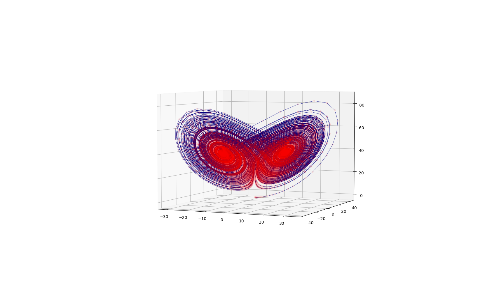

# The Lorenz Attractor
_Author: Alex Viller_
_Last Update: 17/08/2022_

This module computes and displays the Lorenz Attractor with $\sigma = 16$, $\rho = 40$, $\beta = 4$. This gives the attractor fractal properties

## Result Figure

## References
[https://en.wikipedia.org/wiki/Lorenz_system](https://en.wikipedia.org/wiki/Lorenz_system) - Visited on 17/08/2022

[The fractal dimension of the Lorenz attractor - Mark J.McGuinness](https://doi.org/10.1016/0375-9601(83)90052-X) - Visited on 17/08/2022